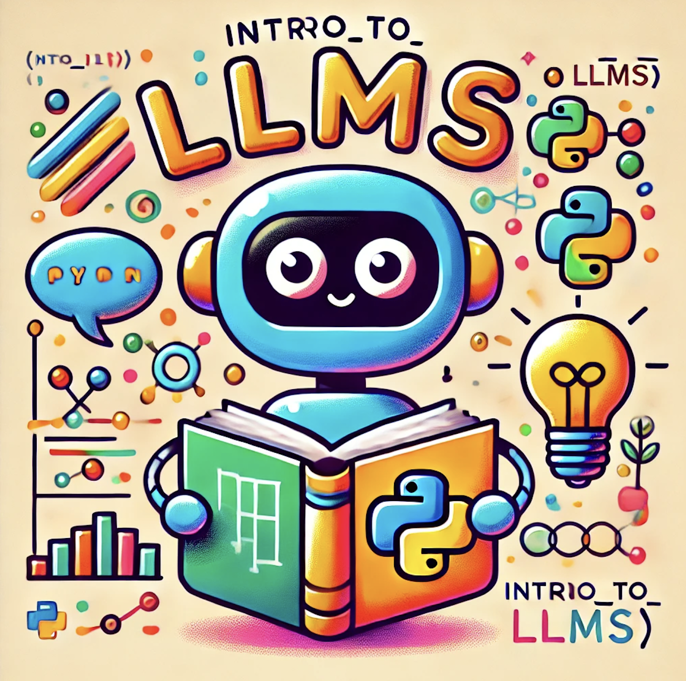

# Introduction to Large Language Models (LMMs)



Welcome to the **Intro to LMMs** repository! This repo provides resources, code, and guides for learning about Large Language Models (LMMs).

---

## 📚 Table of Contents

- [Introduction](#introduction)
- [Resources](#resources)
- [Installation](#installation)
- [Code Examples](#code-examples)
- [Projects & Hackathons](#projects--hackathons)
- [User Interfaces](#user-interfaces)
- [Acknowledgements](#acknowledgement)
- [Packaging & PyPI](#making-this-a-package)
- [Documentation](#documentation-using-makedocs)
- [Docker](#running-docker)
- [Contact](#contact)

---

## Introduction

This repository contains teaching resources and code for an introductory course on large language models (LMMs).

---

## Resources

### Visual & Conceptual Overviews

- [Generative AI Visual Explanation (FT)](https://ig.ft.com/generative-ai/)
- [Introduction to LLMs Theory (Cambridge)](https://docs.science.ai.cam.ac.uk/large-language-models/Introduction/Introduction/)
- [Andrej Karpathy: GPT-2 from Scratch (YouTube)](https://www.youtube.com/watch?v=kCc8FmEb1nY)
- [Vizuara Video Series](https://www.youtube.com/watch?v=Xpr8D6LeAtw&list=PLPTV0NXA_ZSgsLAr8YCgCwhPIJNNtexWu) | [Vizuara Newsletter](https://www.vizuaranewsletter.com/p/9e1)
- [3Blue1Brown Deep Learning Playlist](https://www.youtube.com/playlist?list=PLZHQObOWTQDNU6R1_67000Dx_ZCJB-3pi)
  - [Embedding](https://www.youtube.com/watch?v=wjZofJX0v4M)
  - [Transformer](https://www.youtube.com/watch?v=eMlx5fFNoYc&vl=en)
  - [GPT Visualized](https://www.3blue1brown.com/lessons/gpt)

### Attention Mechanism

- [Introduction to Attention (YouTube)](https://www.youtube.com/watch?v=XN7sevVxyUM)
- [Animated Explanation](https://jalammar.github.io/illustrated-transformer/)
- [Wikipedia: Attention in ML](https://en.wikipedia.org/wiki/Attention_(machine_learning))
  - [Diagram](https://en.wikipedia.org/wiki/Attention_(machine_learning)#/media/File:Attention-qkv.png)

### Other Topics

- [Next Token Prediction Article](https://medium.com/@akash.kesrwani99/understanding-next-token-prediction-concept-to-code-1st-part-7054dabda347)
- [LangChain & HuggingFace Example](https://python.langchain.com/docs/integrations/chat/huggingface/)

---

## 🚀 Installation

```bash
pip install -r requirements-handson.txt

mkdir -p /home/codespace/.local/lib/python3.12/site-packages/google/colab
```

Add your API key:  
Create a `.env` file and add:

```
OPENAI_API_KEY = "<yourapikeywhichisprivate>"
```

Create a `.gitignore` file and add:

```
.env
```

If using Google Colab:  
Set your `OPENAI_API_KEY` in the Colab secrets tab.

You can run the notebooks in GitHub codespaces or Google Colab.

---

## 💻 Code Examples

- [`hands-on-llms` Repository](https://github.com/neelsoumya/hands-on-llms)
- [AccelerateScience LLM Resources](https://github.com/acceleratescience/large-language-models)
- [Hands-on-LLMs (AccelerateScience)](https://github.com/acceleratescience/hands-on-llms)
- [Codespaces Setup Guide](https://docs.science.ai.cam.ac.uk/hands-on-llms/setting-up/codespaces/)

### Notebooks in This Repo

| Notebook | Description | Link |
|----------|-------------|------|
| `02_open_ai.ipynb` | Simple code to call OpenAI API | [View](https://github.com/neelsoumya/intro_to_LMMs/blob/main/02_open_ai.ipynb) |
| `L2_NLP_transformers.ipynb` | Facebook open-source model & probing superintelligence | [View](https://github.com/neelsoumya/intro_to_LMMs/blob/main/L2_NLP_transformers.ipynb) |
| `[1_1]_Transformer_from_Scratch_(exercises).ipynb` | Transformers from scratch | [View](https://github.com/neelsoumya/intro_to_LMMs/blob/main/%5B1_1%5D_Transformer_from_Scratch_(exercises).ipynb) |
| `text_classification_with_transformer.ipynb` | Multi-head attention in Keras | [View](https://github.com/neelsoumya/intro_to_LMMs/blob/main/text_classification_with_transformer.ipynb) |
| `tiktoken_demo.ipynb` | Tokenizer demo | [View](https://github.com/neelsoumya/intro_to_LMMs/blob/main/tiktoken_demo.ipynb) |
| `softmax_practical.ipynb` | Softmax function practical | [View](https://github.com/neelsoumya/intro_to_LMMs/blob/main/softmax_practical.ipynb) |
| `Lesson_3-selfattention.ipynb` | Self-attention in PyTorch | [View](https://github.com/neelsoumya/intro_to_LMMs/blob/main/Lesson_3-selfattention.ipynb) |
| `Situational_Awareness_LLMs_LLaMA.ipynb` | Open source LLM situational awareness | [View](https://github.com/neelsoumya/intro_to_LMMs/blob/main/Situational_Awareness_LLMs_LLaMA.ipynb) |
| `Situational_Awareness_LLMs.ipynb` | Closed source LLM situational awareness | [View](https://github.com/neelsoumya/intro_to_LMMs/blob/main/Situational_Awareness_LLMs.ipynb) |
| `arc_solver.ipynb` | ARC & Dudeney puzzle solver | [View](https://github.com/neelsoumya/intro_to_LMMs/blob/main/arc_solver.ipynb) |
| `fine_tune_llm.ipynb` | Finetuning a LLM | [View](https://github.com/neelsoumya/intro_to_LMMs/blob/main/fine_tune_llm.ipynb) |
| `text_translation_summarization.ipynb` | Translation & summarization | [View](https://github.com/neelsoumya/intro_to_LMMs/blob/main/text_translation_summarization.ipynb) |
| `agentic_workflow_llm_opensource.ipynb` | Agentic workflow (open-source) | [View](https://github.com/neelsoumya/intro_to_LMMs/blob/main/agentic_workflow_llm_opensource.ipynb) |
| `introduction_to_stablediffusion.ipynb` | Stable diffusion text-to-image | [View](https://github.com/neelsoumya/intro_to_LMMs/blob/main/introduction_to_stablediffusion.ipynb) |
| ... | ... | ... |

> _See the full list in the original README or browse the notebooks directory!_

---

## 🏆 Projects & Hackathons

- [CFD & ARC Tasks](https://github.com/neelsoumya/CFD_LLM_Accelerate24)
- [Healthcare AI Chatbot](https://github.com/neelsoumya/LLM-Handon)
- [Science Fiction & AI](https://github.com/neelsoumya/science_fiction_LLM)
- [Stock Market Analysis Agent](https://github.com/neelsoumya/stock_portfolio_LLM_agent)
- [National AI Strategies Analysis](https://github.com/neelsoumya/intro_to_LMMs/blob/main/deep_research_agent_ag2_nationalAI_strategy.ipynb)
- [smolagents: Coding Agents](https://github.com/neelsoumya/intro_to_LMMs/tree/main/agents/smolagents/L3)

---

## 🖥️ User Interfaces

- [Streamlit Guide](https://docs.science.ai.cam.ac.uk/large-language-models/streamlit/)

---

## 🙏 Acknowledgement

- Accelerate Science and Ryan Daniels  
  [science.ai.cam.ac.uk](https://science.ai.cam.ac.uk/)  
  [Training Workshops](https://docs.science.ai.cam.ac.uk/training/#accelerate-workshops)  
  [Team](https://science.ai.cam.ac.uk/team/ryan-daniels)

And other contributors and resources listed in the [original README](https://github.com/neelsoumya/intro_to_LMMs/blob/main/README.md).

---

## 📦 Making this a Package

Install locally:

```bash
pip install -e .
```

Sample usage in Python:

```python
from intro_to_LMMs import greet

print(greet())
```

Run tests:

```bash
python -m unittest discover -s tests
```

#### PyPI Upload Steps

1. Install build tools:
    ```bash
    pip install build twine
    ```
2. Build and upload:
    ```bash
    python -m build
    twine upload --repository testpypi dist/*
    ```
3. _See the README for `.pypirc` formatting and instructions._

---

## 📄 Documentation using MkDocs

Generate docs with:

```bash
pip install mkdocs mkdocs-material mkdocs-include-markdown-plugin
mkdocs serve
mkdocs build
mkdocs gh-deploy
```

Visit: [neelsoumya.github.io/intro_to_LMMs](https://neelsoumya.github.io/intro_to_LMMs/)

---

## 🐳 Running Docker

1. Create a `Dockerfile` ([example](https://github.com/neelsoumya/intro_to_LMMs/blob/main/Dockerfile))
2. Build the image:
    ```bash
    docker build -t my-jupyter-image .
    ```
3. Run the container:
    ```bash
    docker run -p 8888:8888 -v $(pwd):/app my-jupyter-image
    ```
4. Access Jupyter at [http://localhost:8888](http://localhost:8888)

---

## 📧 Contact

**Soumya Banerjee**  
Email: sb2333@cam.ac.uk

---
